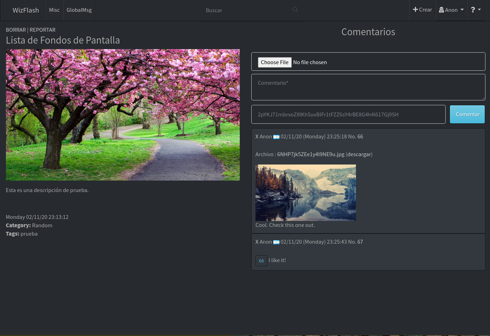
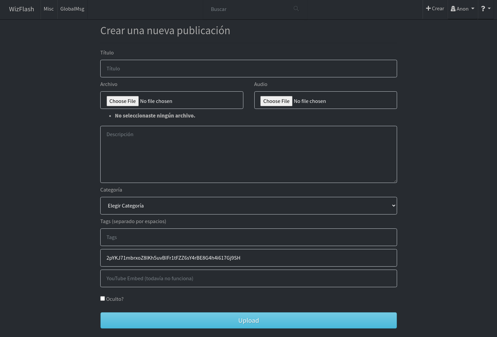

### Installation
pip install -r requirements.txt
### Create the database
On the main dir, open a python3 console and type:
```python
from run import app
from models import *
app.app_context().push()
db.create_all()
```

### Usage
```python
python3 run.py
```

*If you had any kind of issues running this, please let me know, I'm very active here and I'll make sure to read your message.*
*Also I'm open to listen to any advice you may have.*
